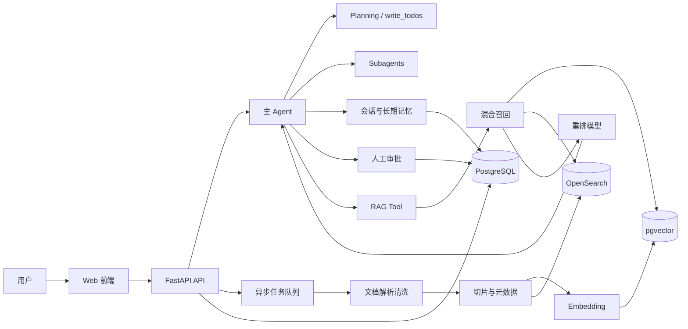

# FishRag

FishRag 是一个面向企业级生产环境的医学知识库 RAG-Agent 系统。项目目标是把医学文档、指南、规范、论文、内部知识库等资料沉淀为可检索、可追溯、可评估的知识系统，并通过具备规划、工具调用、子智能体协作、上下文管理、人工审批和长期记忆能力的 Agent，为用户提供可靠的医学知识问答与任务辅助。

> 重要说明：本系统定位为医学知识辅助与企业内部知识检索工具，不替代医生诊断、治疗建议或监管要求。所有涉及诊疗决策的输出都必须保留来源证据，并支持人工复核。

## 项目状态

当前阶段：阶段 8 评估、测试与生产化基础闭环已完成，已支持文档上传、落盘、状态流转、PDF/TXT/Markdown/CSV/DOCX 解析、文本清洗、章节识别、chunk 入库、embedding 写入、OpenSearch 关键词索引、pgvector 向量检索、BM25 关键词检索、混合召回、reranker 重排、RAG 查询、带引用回答生成、Agent 工具运行时、子 Agent 委托、上下文压缩、技能按需加载、会话管理、消息保存、会话摘要、长期记忆 CRUD、HITL 审批队列、高风险工具审批规则、医学安全拦截、React 前端工作台、RAG 离线评测集格式与 recall@k、MRR、nDCG、faithfulness、citation coverage 指标计算、JSONL 批量评测任务、自动运行 RAG、历史报告查询、PostgreSQL 持久化评测任务、后台状态流转、前端评估面板接入真实评测任务 API、Prometheus 指标、trace context、Grafana Dashboard、超时重试策略、轻量压测脚本、MVP 验收烟测脚本、端到端烟测，以及 Docker 镜像和部署文档。

本仓库将从 0 开始逐步搭建，优先完成一个可运行的 MVP，再逐步增强为企业级 RAG-Agent 平台。当前已完成基础工程骨架、环境变量模板、中间件编排文件、后端 API 入口、前端 Vite 骨架、Agent 规划工具雏形、RAG 文本切片雏形、PostgreSQL/pgvector、Redis、OpenSearch 本地中间件配置，阶段 1 的数据库模型、迁移、认证、RBAC、统一错误响应和请求追踪能力，阶段 2 的文档上传、落盘、基础解析、文本清洗、chunk 入库、向量写入和关键词索引能力，阶段 3 的检索、融合、重排和回答生成能力，阶段 4 的 Agent 运行时、工具调用、子任务委托、上下文压缩、技能加载和记忆工具能力，阶段 5 的会话、消息、摘要和长期记忆管理能力，阶段 6 的人工审批、高风险工具中断和医学安全保护能力，阶段 7 的 Web 工作台基础界面与 API 接入能力，以及阶段 8 的评估、测试、可观测性和部署基础能力。

## 建设目标

- 构建支持多格式医学文档导入、清洗、切片、向量化和索引的知识库。
- 提供混合检索能力，支持关键词检索、向量检索、多路召回、重排和引用溯源。
- 构建主 Agent，支持任务规划、工具调用、RAG 查询、会话记忆和安全审批。
- 支持子智能体委托，让代码审查、文档解析、网络研究、知识库维护等任务隔离运行。
- 支持多用户、多会话、短期上下文恢复和长期记忆沉淀。
- 提供可观测、可评估、可部署的生产化基础能力。

## 核心用户

- 医学知识库使用者：通过自然语言查询内部医学资料、指南、论文和制度文档。
- 医学知识库管理员：上传、审核、更新、删除和评估知识库内容。
- 企业开发与运维人员：部署系统、接入模型服务、维护向量库、监控任务与调用链路。
- 审核人员：对高风险工具调用、关键回答、知识库更新进行人工确认。

## 核心场景

- 医学资料问答：用户提问后，系统从知识库中召回证据片段并生成带引用的回答。
- 指南与规范查询：按疾病、药物、适应症、禁忌症、检查项目等维度查询资料。
- 内部知识库问答：支持企业内部制度、SOP、培训材料、FAQ 等文档检索。
- 文档入库：上传 PDF、Word、TXT、Markdown、CSV 等文件，自动清洗、切片、向量化并建立索引。
- 多轮会话：保留用户会话上下文，支持继续追问、对比、总结和任务规划。
- 人工审批：对文件写入、知识库变更、外部 API 调用、高风险回答等操作触发人工确认。
- 质量评估：构造评测集，统计召回率、命中率、重排质量、答案忠实度和引用覆盖率。

## 功能模块

### 1. 规划能力 Planning

系统需要为 Agent 提供结构化任务规划能力。

- 已实现 `write_todos` 核心能力，允许 Agent 创建、更新和维护任务清单。
- 已提供 HTTP API：`/api/v1/planning/sessions/{session_id}/todos`。
- 每个任务至少包含 `id`、`content`、`status`、`created_at`、`updated_at`。
- 任务状态支持 `pending`、`in_progress`、`completed`，后续可扩展 `blocked`、`cancelled`。
- 任务清单需要和会话绑定，支持恢复长周期任务。
- Agent 在复杂任务中应优先拆解步骤，再逐步执行和更新状态。

### 2. 任务委托与子智能体 Task Delegation / Subagents

主 Agent 需要支持把专项任务委托给不同子智能体。

- 提供 `task` 工具或等价调度机制，用于创建子任务。
- 支持预定义子 Agent，例如：
  - `rag_researcher`：负责知识库检索、证据整理和引用提取。
  - `document_processor`：负责文档解析、清洗、分块策略建议。
  - `medical_reviewer`：负责医学安全、回答合规性和证据完整性检查。
  - `code_reviewer`：负责代码审查和风险检查。
- 子 Agent 与主 Agent 上下文隔离，避免污染主对话。
- 支持多个子 Agent 并发运行，并汇总结果给主 Agent。
- 子任务结果需要记录来源、输入、输出、耗时和错误信息。

### 3. 上下文管理 Context Management

系统需要管理长对话、工具结果和复杂任务上下文，避免超出模型窗口。

- 启动上下文包括系统提示词、用户信息、会话摘要、待办列表、长期记忆、可用技能、工具说明。
- 工具调用结果过大时，自动落盘或存储到对象存储，并在上下文中保留摘要和路径。
- 当会话上下文接近模型窗口阈值时，自动触发压缩、摘要或归档。
- 区分短期上下文、会话摘要、长期记忆、知识库证据，不混用不同来源。
- 所有用于回答的 RAG 证据必须保留文档来源、页码或片段定位信息。

### 4. 人工介入 Human-in-the-loop

系统需要在高风险操作前引入人工审批。

- 支持通过 `interrupt_on` 或等价策略配置需要审批的工具。
- 默认需要审批的操作：
  - 修改或删除知识库文档。
  - 批量导入、覆盖索引、删除向量。
  - 调用外部付费 API 或联网检索。
  - 输出高风险医学建议。
  - 执行文件写入、脚本运行、系统命令等操作。
- 审批人可以批准、拒绝或修改工具输入。
- 审批记录需要持久化，便于审计。

### 5. 技能包加载与管理 Skills

系统需要支持按需加载任务技能，减少上下文占用。

- 每个技能使用独立目录描述，包含元数据、触发条件和详细说明。
- Agent 启动时只加载技能元信息，命中任务时再加载完整技能内容。
- 技能可覆盖文档入库、医学审核、RAG 评估、代码审查、报告生成等场景。
- 技能版本需要可追踪，避免生产环境中提示词不可控变化。

### 6. 用户、会话与记忆

系统需要支持多用户、多会话和长期记忆。

- 支持用户注册、登录、鉴权和权限控制。
- 支持创建、重命名、归档、删除和恢复会话。
- 短期记忆：保存当前会话消息、工具调用、任务清单和会话摘要。
- 长期记忆：保存用户偏好、常用知识领域、输出格式偏好、历史目标等。
- 长期记忆需要可查看、可编辑、可删除，避免不可控沉淀。
- 会话体验参考 DeepSeek、ChatGPT 等网页会话记录模式。

### 7. RAG 存储系统

系统需要把医学资料转化为可检索知识资产。

- 支持文件类型：PDF、Word、TXT、Markdown、CSV，后续扩展 HTML、Excel、图片 OCR。
- 文档处理流程：
  1. 文件上传与元数据登记。
  2. 文件解析和格式标准化。
  3. 去页眉页脚、目录、重复水印、无效空白等噪声。
  4. 章节结构识别。
  5. 文本切片和语义分块。
  6. 向量化。
  7. 写入向量库、关键词索引和文档元数据库。
- 每个 chunk 需要保留 `document_id`、`chunk_id`、标题、章节、页码、来源路径、版本号和哈希。
- 支持重复文档检测、增量更新和重建索引。

### 8. RAG 召回系统

系统需要提供稳定、可评估、可追溯的检索增强生成能力。

- 支持关键词检索和向量检索并行召回。
- 支持多路召回融合，例如 BM25、dense embedding、metadata filter、query rewrite。
- 支持 reranker 对候选片段重排。
- 支持按知识库、文档类型、时间、标签、权限范围过滤。
- 回答必须尽量引用证据，引用格式需要能定位到原文片段。
- 当知识库没有证据时，应明确说明“不确定”或“知识库未检索到依据”。
- 支持构建评测集，并显示召回、重排和回答质量指标。

## 技术栈

| 层级 | 推荐技术 | 说明 |
| --- | --- | --- |
| 后端 API | Python 3.11+、FastAPI、Pydantic | 提供 REST API、鉴权、会话、文档和 Agent 调用入口 |
| Agent 编排 | LangGraph / LangChain、OpenAI-compatible Chat API | 支持工具调用、状态图、子智能体、HITL 和上下文管理 |
| 异步任务 | Celery 或 RQ、Redis | 处理文档解析、向量化、索引构建、评估任务 |
| 关系数据库 | PostgreSQL | 存储用户、会话、文档元数据、任务、审计日志 |
| 向量数据库 | pgvector | MVP 阶段直接依赖 PostgreSQL，降低系统复杂度 |
| 关键词检索 | OpenSearch / Elasticsearch | 提供 BM25、过滤查询和生产级全文检索能力 |
| 缓存与队列 | Redis | 缓存会话、任务状态、限流数据和后台任务队列 |
| 文档解析 | PyMuPDF、python-docx、Markdown parser、pandas | 解析 PDF、Word、Markdown、TXT、CSV |
| 云端模型 | DeepSeek / OpenAI-compatible API | 默认接入 DeepSeek 云端 Chat，不要求本机部署大模型 |
| Embedding | SiliconFlow、BAAI/bge-m3 | DeepSeek 负责聊天，Embedding 独立使用向量模型服务 |
| Reranker | SiliconFlow、BAAI/bge-reranker-v2-m3 | DeepSeek 负责聊天，Reranker 独立使用重排模型服务 |
| 前端 | React、TypeScript、Vite、Tailwind CSS | 构建聊天、知识库、任务、评估和管理界面 |
| 权限认证 | JWT、RBAC | 支持用户、角色、知识库权限和审计 |
| 可观测性 | OpenTelemetry、Prometheus、Grafana、结构化日志 | 追踪请求、模型调用、检索耗时、任务状态 |
| 部署 | Docker、Docker Compose，后续 Kubernetes | 本地开发和企业部署统一环境 |
| 测试 | pytest、ruff、mypy、Playwright | 覆盖后端、RAG、Agent、前端和端到端流程 |

## 初始架构



## 计划目录结构

```text
FishRag/
  apps/
    api/                  # FastAPI 服务
    web/                  # React 前端
  packages/
    agent/                # Agent、工具、子智能体、HITL
    rag/                  # 文档处理、检索、重排、评估
    common/               # 通用配置、日志、异常、类型
  migrations/             # 数据库迁移
  tests/                  # 单元测试、集成测试、端到端测试
  docker/                 # Docker 与部署配置
  docs/                   # 设计文档和接口文档
  README.md
```

## 相关文档

- [环境搭建](docs/setup.md)
- [中间件配置](docs/middleware.md)
- [阶段 1 后端基础](docs/backend_stage1.md)
- [规划能力](docs/planning.md)
- [文档入库](docs/documents.md)
- [RAG 检索与回答](docs/retrieval.md)
- [Agent 能力](docs/agent.md)
- [会话与记忆](docs/sessions.md)
- [人工审批与安全](docs/approvals.md)
- [前端工作台](docs/frontend.md)
- [RAG 评估](docs/evaluation.md)
- [可观测性](docs/observability.md)
- [部署说明](docs/deployment.md)
- [验收与演示](docs/acceptance.md)

## 任务清单

### 阶段 0：项目初始化

- [x] 确认 MVP 范围、用户角色和关键业务流程。
- [x] 初始化 Python 后端工程结构。
- [x] 初始化 React 前端工程结构。
- [x] 配置 Docker Compose：PostgreSQL、Redis、OpenSearch。
- [x] 配置代码规范：ruff、mypy、pytest、prettier、eslint。
- [x] 建立 `.env.example` 和配置加载模块。

### 本地中间件状态

- [x] PostgreSQL 16.14 + pgvector 0.8.2：`localhost:5432`
- [x] Redis 7：`localhost:6379`
- [x] OpenSearch 2.15：`http://localhost:9200`

### 阶段 1：后端基础能力

- [x] 创建 FastAPI 应用入口、健康检查和统一错误处理。
- [x] 设计数据库表：用户、会话、消息、文档、chunk、任务、审批、记忆。
- [x] 接入 PostgreSQL 迁移工具。
- [x] 实现 JWT 登录鉴权和基础 RBAC。
- [x] 实现结构化日志和请求追踪 ID。
- [x] 在本地 PostgreSQL/pgvector 上完成 Alembic 初始迁移验证。

### 阶段 2：文档入库 MVP

- [x] 实现文件上传接口。
- [x] 规范文件落盘路径：`<FISHRAG_UPLOAD_DIR>/<yyyy>/<mm>/<dd>/<document_id>/<safe_filename>`。
- [x] 实现 PDF、TXT、Markdown、CSV、DOCX 解析适配层。
- [x] 提供文档解析预览 API：`POST /api/v1/documents/{document_id}/parse`。
- [x] 接入 PDF 解析依赖并完成 PDF 文件实测。
- [x] 实现文本清洗、章节识别和 chunk 切分。
- [x] 将 chunk 写入 `document_chunks` 表，保留字符范围、章节路径和 token 粗估元数据。
- [x] 实现 embedding 接口适配层。
- [x] 将 chunk 向量写入 `document_chunks.embedding`。
- [x] 将文本和元数据写入 OpenSearch 关键词索引。
- [x] 实现文档状态流转：uploaded、processing、indexed、failed。

### 阶段 3：RAG 检索与回答

- [x] 实现向量检索。
- [x] 实现关键词 BM25 检索。
- [x] 实现多路召回融合。
- [x] 实现 reranker 重排。
- [x] 实现 RAG 查询工具 `rag_search`。
- [x] 实现带引用的回答生成。
- [x] 实现无证据回答策略。

### 阶段 4：Agent 能力

- [x] 实现主 Agent 运行时。
- [x] 实现 `write_todos` 规划工具。
- [x] 实现子 Agent 注册和任务委托。
- [x] 实现上下文摘要与大结果压缩。
- [x] 实现技能包元数据加载与按需加载。
- [x] 将 RAG 工具、记忆工具、任务工具接入 Agent。

### 阶段 5：会话与记忆

- [x] 实现多会话创建、列表、重命名、归档和删除。
- [x] 保存消息、工具调用和 Agent 中间状态。
- [x] 实现会话摘要生成和恢复。
- [x] 实现长期记忆的创建、检索、更新、删除。
- [x] 为长期记忆增加用户可控开关和审计记录。

### 阶段 6：人工审批与安全

- [x] 实现 HITL 审批队列。
- [x] 为高风险工具配置审批规则。
- [x] 实现批准、拒绝、修改输入后继续执行。
- [x] 记录审批日志和操作审计。
- [x] 增加医学安全提示、免责声明和高风险回答拦截。

### 阶段 7：前端界面

- [x] 实现登录页面和基础布局。
- [x] 实现聊天界面、会话列表和消息引用展示。
- [x] 实现文档上传、入库状态和文档管理。
- [x] 实现任务清单展示和 Agent 执行状态。
- [x] 实现审批中心。
- [x] 实现 RAG 评估面板。

### 阶段 8：评估、测试与生产化

- [x] 构建 RAG 评测集格式。
- [x] 统计 recall@k、MRR、nDCG、faithfulness、citation coverage。
- [x] 支持 JSONL 批量评测任务、自动运行 RAG 和历史报告查询。
- [x] 将评测任务持久化到 PostgreSQL，并支持 queued、running、completed、failed 状态流转。
- [x] 前端评估面板接入真实评测任务列表、创建和报告详情。
- [x] 增加单元测试、集成测试和端到端测试。
- [x] 增加性能压测和超时重试策略。
- [x] 接入 trace context、Prometheus metrics 和 Grafana Dashboard。
- [x] 完成 Docker 镜像和部署文档。
- [x] 增加 MVP 验收烟测脚本和演示流程文档。

## MVP 验收标准

- 能上传至少 5 类文档并完成解析、清洗、切片、向量化和索引。
- 能在聊天界面中基于知识库回答问题。
- 回答中能展示引用片段和文档来源。
- 支持多用户、多会话保存与恢复。
- 支持 `write_todos` 任务规划。
- 支持至少 2 个子 Agent 并发执行并返回结果。
- 高风险操作能进入人工审批流程。
- 能输出基础 RAG 评估指标。
- 所有服务可通过 Docker Compose 在本地启动。
- 可通过 `python tools/acceptance_smoke.py --base-url http://localhost:8000/api/v1` 验证 health、metrics 和 RAG 评估打分闭环。

## 后续搭建顺序

1. 搭建后端工程骨架和 Docker Compose 基础环境。
2. 设计数据库模型与迁移脚本。
3. 实现文档上传、解析、清洗和入库。
4. 实现 pgvector 向量检索与关键词检索。
5. 实现 RAG 问答 API。
6. 实现 Agent 工具调用、规划和会话记忆。
7. 实现子 Agent 与人工审批。
8. 搭建前端聊天和知识库管理界面。
9. 增加评估、监控、测试和部署能力。

## 云端模型接入

项目默认使用 DeepSeek 云端聊天模型服务，不需要本机部署大模型。复制 `.env.example` 为 `.env` 后，把下面的 Key 替换成你的 DeepSeek API Key：

```text
FISHRAG_LLM_API_KEY=sk-...
```

Embedding 和 Reranker 默认继续使用 SiliconFlow，请把下面两个 Key 替换成你的 SiliconFlow API Key：

```text
FISHRAG_EMBEDDING_API_KEY=sk-...
FISHRAG_RERANKER_API_KEY=sk-...
```

默认模型配置：

```text
FISHRAG_LLM_PROVIDER=deepseek
FISHRAG_LLM_BASE_URL=https://api.deepseek.com
FISHRAG_CHAT_MODEL=deepseek-v4-flash
FISHRAG_LLM_THINKING=disabled
FISHRAG_EMBEDDING_PROVIDER=siliconflow
FISHRAG_EMBEDDING_BASE_URL=https://api.siliconflow.cn/v1
FISHRAG_EMBEDDING_MODEL=BAAI/bge-m3
FISHRAG_RERANKER_PROVIDER=siliconflow
FISHRAG_RERANKER_BASE_URL=https://api.siliconflow.cn/v1
FISHRAG_RERANKER_MODEL=BAAI/bge-reranker-v2-m3
```

DeepSeek 和 SiliconFlow 可以同时使用：Chat、Embedding、Reranker 是三条独立调用链，后续也可以分别替换供应商。

## 开发约定

- 所有核心能力先做可测试的后端模块，再接入 Agent 和前端。
- RAG 回答必须优先基于检索证据，不允许把模型猜测伪装成知识库事实。
- 文档、chunk、回答引用都必须保留可追溯 ID。
- 涉及用户数据和医学资料的操作必须记录审计日志。
- 模型、embedding、reranker 通过适配层接入，避免与单一厂商强绑定。
